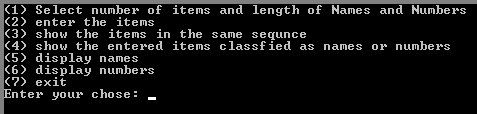
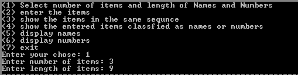
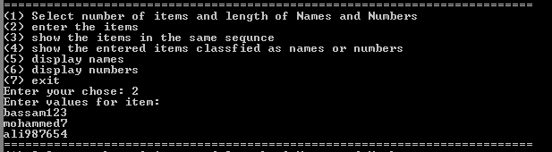
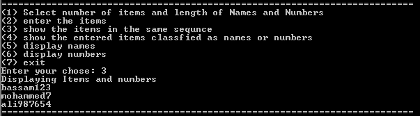
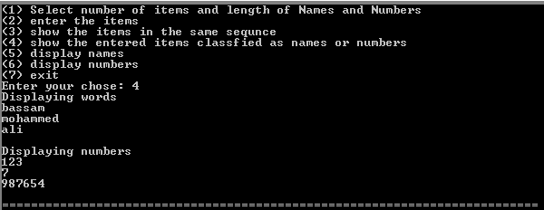
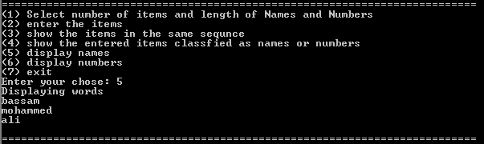
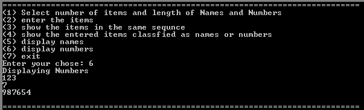
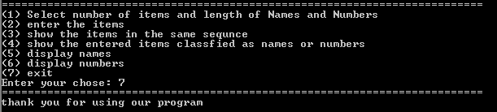

<h1 style = "text-align:center;">menu and operations</h1>

## **Functional Requirements**

In this project, we divide the requirements into a set of functionalities. Each function is described separately, and then we provide an overall system description that combines all functions together.

At the beginning of the project, an opening screen appear (OpenMenu). The user is asked to enter one of the following menu options:

* To Select number of items and length of Names and Numbers press 1
* To Enter the items press 2
* To show the entered items in the same sequence of entrance 3
* To show the entered items classified as Names and Numbers 4
* To Display Names press 5
* To display Numbers press 6
* To Exit press 7

---

## **Number of Items**
If the user selects 1 in the previous menu (OpenMenu), the user will be allowed to select the number of items to be entered and the length of Names and Numbers. 

Once the number of items and length of Names and Numbers are entered, the system go back to OpenMenu. 
The user can select 1 again to change the previously entered data or select 2 to enter the items.

## **Entering Items**
In this part, the system ask the user to enter the data for each Name/Number individually. 

After entering the items the system go back to OpenMenu where he is allowed to press 1 to change number and length of Names/Numbers, 2 to change Names/Numbers, 3/4  to show the items either in the same sequence as they were entered or classified to Names and Numbers.

## **Displaying Names/Numbers**
If the user selects 5, the system display the Names. If the user presses 6, the system display Numbers.
In either case, if the user presses a space bar, the program return to the main menu (OpenMenu).   

---

## **Summary**
* Selecting the number of items and length of Names and Numbers is done by selecting 1 from OpenMenu.
* Entering the items is done by selecting 2 from OpenMenu.
* Displaying the items either in the sequence of their entrance or classified to Names and Numbers is done by selecting 3/4.
* If the user wishes to display the Names, this is done by pressing 5.
* If the user wishes to display the Numbers, this is done by pressing 6.

* If a user wishes to quit the program, press 7 in OpenMenu. A quit is only accepted when the user is in the OpenMenu mode.
* If the user selects the same option again from Open Menu, then can change the previously entered data for that option.

---

## **simple output**
### menub

 

### option 1

 

### option 2

 

### option 3

 

### option 4

 

### option 5

 

### option 6

 

### option 7

 

